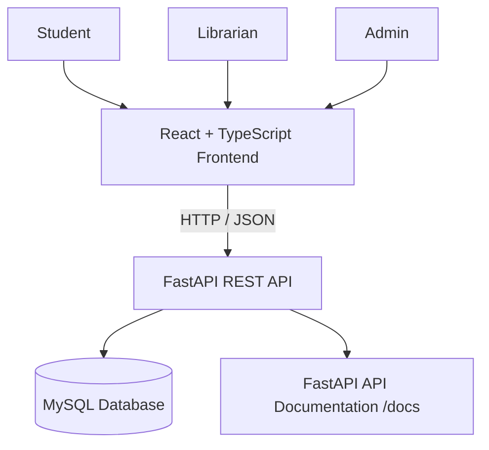
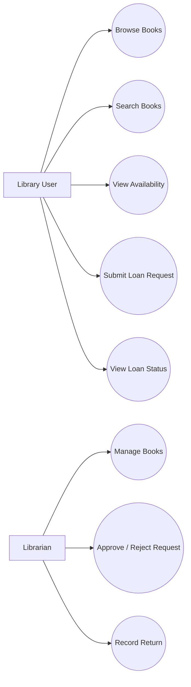
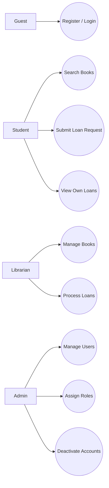
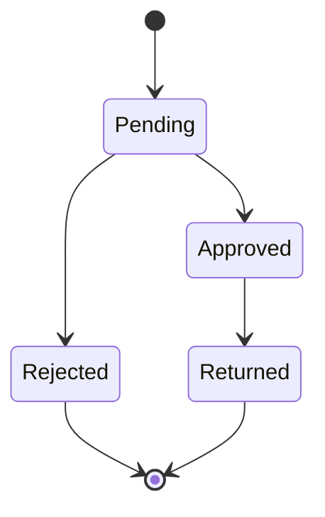

# LibraryNest — Software Requirements Specification (SRS)

| **Field**    | **Value**                                                                                      |
| ------------ | ---------------------------------------------------------------------------------------------- |
| Product      | LibraryNest                                                                                    |
| Version      | MVP + Beta                                                                                     |
| Releases     | MVP — Mid-term, Beta — Final                                                                   |
| Status       | Draft                                                                                          |
| Related docs | [Product Requirements Document (PRD)](01-prd.md), [Technical Design Document (TDD)](03-tdd.md) |

Every requirement has a **Release** column: **MVP** is built for the mid-term demonstration, and **Beta** adds authentication, role-based permissions, user management, and security for the final demonstration.

**Documents in this set**

| **Short form** | **Full form**                       | **Purpose**                                              | **File**         |
| -------------- | ----------------------------------- | -------------------------------------------------------- | ---------------- |
| PRD            | Product Requirements Document       | What we build and why                                    | `docs/01-prd.md` |
| SRS            | Software Requirements Specification | Exact requirements, permissions, and acceptance criteria | `docs/02-srs.md` |
| TDD            | Technical Design Document           | Architecture, database design, and API                   | `docs/03-tdd.md` |

## 1. Introduction

### 1.1 Purpose

This document specifies the requirements for LibraryNest: the MVP (book management, book search, availability, and core loan management) and the Beta (user accounts, roles, permissions, and security).

### 1.2 Scope

* **MVP:** Users can browse and search books, view availability, and use the core loan request workflow. Authorized library operations can manage book records and loan statuses. The application stores data in MySQL.
* **Beta:** Users can register and log in, students can view their own loan records, librarians manage books and loan operations, and admins manage user accounts and roles.
* **Out of scope:** Online payments, email notifications, advanced reservation queues, AI-based recommendations, and other features listed as out of scope in the [PRD, section 5](01-prd.md).

### 1.3 Definitions

| **Term**       | **Meaning**                                                                                              |
| -------------- | -------------------------------------------------------------------------------------------------------- |
| CRUD           | Create, Read, Update, Delete                                                                             |
| REST           | An API style that uses HTTP methods to work with resources                                               |
| Book           | A library catalog record containing details such as title, author, ISBN, and availability                |
| Loan           | A record representing a book loan request and its status                                                 |
| Loan request   | A request submitted by a user to borrow a book                                                           |
| Loan status    | The current state of a loan request, such as Pending, Approved, Rejected, or Returned                    |
| REST API       | An interface that allows the frontend or another client to communicate with the backend                  |
| RBAC           | Role-Based Access Control: permissions depend on the caller's role                                       |
| Authentication | Verifying the identity of a user                                                                         |
| Authorization  | Checking whether an authenticated user is permitted to perform an action                                 |
| Student        | A registered user who searches for books and manages personal loan requests                              |
| Librarian      | A user authorized to manage books and process loan requests and returns                                  |
| Admin          | A user authorized to manage accounts and assign roles                                                    |
| MySQL          | The relational database used to store LibraryNest data                                                   |
| OpenAPI        | A standard description of the API that FastAPI generates and exposes through its documentation interface |

## 2. Overall description

### 2.1 System context

LibraryNest consists of a React + TypeScript frontend, a FastAPI + Python backend, and a MySQL database.

The frontend sends HTTP requests to the backend. The backend validates requests, applies business rules and permissions, and reads or updates records in MySQL. In the Beta release, authentication and authorization are enforced by the backend.

### 2.2 Users and roles

| **Role**                | **Release** | **Description**                                                                                  |
| ----------------------- | ----------- | ------------------------------------------------------------------------------------------------ |
| Unauthenticated visitor | MVP         | Can browse the catalog, search books, and view availability. The MVP has no individual accounts. |
| Library operator        | MVP         | Performs the core book and loan management operations for the demonstration.                     |
| Guest                   | Beta        | Not logged in; can register, log in, and access public book browsing and API documentation.      |
| Student                 | Beta        | Searches for books, views availability, submits loan requests, and views personal loan records.  |
| Librarian               | Beta        | Manages book records, reviews loan requests, approves or rejects requests, and records returns.  |
| Admin                   | Beta        | Manages user accounts, assigns roles, and deactivates accounts.                                  |

In the Beta, `student`, `librarian`, and `admin` are global roles stored with each user account. Permissions are enforced by the backend, not only by hiding frontend buttons.

### 2.3 Use cases

**MVP**

**Beta**

An authenticated user can access only the operations permitted by their role. An Admin manages user accounts and roles; a Librarian manages library operations; a Student manages their own loan requests and views personal loan records.

### 2.4 Constraints

* C-1: The frontend must use React with TypeScript.
* C-2: The backend must use Python with FastAPI.
* C-3: MySQL is the database for both releases.
* C-4: The frontend and backend communicate through REST APIs using JSON.
* C-5: The backend must validate input and return appropriate HTTP status codes.
* C-6: In the Beta, authentication and permission checks must be implemented on the server.
* C-7: API endpoints and request/response schemas must be documented through FastAPI's `/docs` interface.
* C-8: The deployment environment must support the backend and provide a connection to MySQL.

### 2.5 Assumptions

* A-1: A working MySQL instance is available to the application.
* A-2: The application is primarily intended for a university library demonstration and a limited number of users.
* A-3: In the MVP, the demonstration does not require individual user accounts.
* A-4: In the Beta, an initial Admin account can be configured through a controlled setup process.
* A-5: Book availability is maintained from the book's recorded copy information and loan activity.
* A-6: Loan policies, such as loan duration and borrowing limits, will remain simple unless the instructor specifies additional rules.

## 3. Functional requirements

### 3.1 Book management — MVP

| **ID** | **Requirement**                                                                                                                                        | **Release** | **Story**           |
| ------ | ------------------------------------------------------------------------------------------------------------------------------------------------------ | ----------- | ------------------- |
| FR-01  | The system shall create a book record from a JSON request containing a required title, author, and ISBN. Other supported book details may be optional. | MVP         | US-01               |
| FR-02  | The system shall return a list of book records.                                                                                                        | MVP         | US-02               |
| FR-03  | The system shall return one book record by its ID.                                                                                                     | MVP         | US-02               |
| FR-04  | The system shall update supported fields of an existing book record without changing fields that were not submitted.                                   | MVP         | US-03               |
| FR-05  | The system shall delete a book record when the deletion is permitted by the loan data constraints.                                                     | MVP         | US-03               |
| FR-06  | The system shall reject invalid book input with status `422` and identify the invalid field.                                                           | MVP         | US-09               |
| FR-07  | The system shall return `404` when a requested book ID does not exist.                                                                                 | MVP         | US-09               |
| FR-08  | The system shall store book records in MySQL so that the data persists after an application restart.                                                   | MVP         | US-01, US-02        |
| FR-09  | The system shall expose book creation, listing, retrieval, update, and deletion through REST API endpoints.                                            | MVP         | US-01, US-02, US-03 |

### 3.2 Book search and availability — MVP

| **ID** | **Requirement**                                                                              | **Release** | **Story** |
| ------ | -------------------------------------------------------------------------------------------- | ----------- | --------- |
| FR-10  | The system shall allow book searches by title.                                               | MVP         | US-04     |
| FR-11  | The system shall allow book searches by author.                                              | MVP         | US-04     |
| FR-12  | The system shall allow book searches by ISBN.                                                | MVP         | US-04     |
| FR-13  | The system shall return book details and the recorded availability status in search results. | MVP         | US-05     |
| FR-14  | The system shall return an empty result set when no books match a valid search query.        | MVP         | US-04     |
| FR-15  | The system shall validate search parameters and return a clear error for invalid input.      | MVP         | US-09     |

### 3.3 Loan management — MVP

| **ID** | **Requirement**                                                                                                     | **Release** | **Story**           |
| ------ | ------------------------------------------------------------------------------------------------------------------- | ----------- | ------------------- |
| FR-16  | The system shall allow a library user to submit a loan request for an existing book.                                | MVP         | US-06               |
| FR-17  | A newly submitted loan request shall have status `Pending`.                                                         | MVP         | US-06               |
| FR-18  | The system shall return loan request records and their current statuses.                                            | MVP         | US-07               |
| FR-19  | The system shall allow the library operator to approve or reject a pending loan request.                            | MVP         | US-08               |
| FR-20  | The system shall allow the library operator to record a book return for an approved loan.                           | MVP         | US-08               |
| FR-21  | The system shall reject an invalid loan request or an invalid status transition with an appropriate error response. | MVP         | US-09               |
| FR-22  | The system shall store loan requests and status changes in MySQL.                                                   | MVP         | US-06, US-07, US-08 |
| FR-23  | The system shall maintain consistent book availability when a loan is approved or a book is returned.               | MVP         | US-05, US-08        |

### 3.4 Authentication and profile — Beta

| **ID** | **Requirement**                                                                                                                     | **Release** | **Story** |
| ------ | ----------------------------------------------------------------------------------------------------------------------------------- | ----------- | --------- |
| FR-24  | The system shall allow a guest to register with a name, email, and password. Email addresses shall be unique, ignoring letter case. | Beta        | US-10     |
| FR-25  | The system shall allow a registered user to log in with valid credentials. Invalid credentials shall return `401 Unauthorized`.     | Beta        | US-11     |
| FR-26  | The system shall identify authenticated requests using the project's selected authentication mechanism.                             | Beta        | US-11     |
| FR-27  | The system shall allow an authenticated student to view their own loan records.                                                     | Beta        | US-12     |
| FR-28  | The system shall never return a user's password or password hash in API responses.                                                  | Beta        | US-17     |
| FR-29  | The system shall reject protected requests without valid authentication using `401 Unauthorized`.                                   | Beta        | US-15     |
| FR-30  | The system shall allow a user to view their own basic account information.                                                          | Beta        | US-12     |

### 3.5 Roles and user management — Beta

| **ID** | **Requirement**                                                                                                                                 | **Release** | **Story**    |
| ------ | ----------------------------------------------------------------------------------------------------------------------------------------------- | ----------- | ------------ |
| FR-31  | Every registered user shall have one role: `student`, `librarian`, or `admin`.                                                                  | Beta        | US-15        |
| FR-32  | The system shall restrict book management operations to authorized roles according to the permission matrix.                                    | Beta        | US-13, US-15 |
| FR-33  | The system shall restrict loan approval, rejection, and return operations to the Librarian role and any explicitly authorized Admin operations. | Beta        | US-13, US-15 |
| FR-34  | An Admin shall be able to list registered user accounts.                                                                                        | Beta        | US-14        |
| FR-35  | An Admin shall be able to assign or update a user's role.                                                                                       | Beta        | US-14        |
| FR-36  | An Admin shall be able to deactivate a user account.                                                                                            | Beta        | US-16        |
| FR-37  | A deactivated account shall not be able to use protected endpoints.                                                                             | Beta        | US-16, US-17 |
| FR-38  | A non-Admin user calling an Admin-only endpoint shall receive `403 Forbidden`.                                                                  | Beta        | US-14, US-15 |

### 3.6 Security and API behavior — Beta

| **ID** | **Requirement**                                                                                                             | **Release** | **Story**    |
| ------ | --------------------------------------------------------------------------------------------------------------------------- | ----------- | ------------ |
| FR-39  | The system shall store passwords using a suitable password-hashing algorithm rather than plain text.                        | Beta        | US-17        |
| FR-40  | The system shall validate user input on the backend before processing protected operations.                                 | Beta        | US-15, US-17 |
| FR-41  | The system shall keep database credentials and authentication secrets in environment configuration rather than source code. | Beta        | US-17        |
| FR-42  | The system shall return consistent error responses without exposing stack traces, password data, or database credentials.   | Beta        | US-17        |

### 3.7 Validation rules

| **Field**          | **Rule**                                                                                | **Release** |
| ------------------ | --------------------------------------------------------------------------------------- | ----------- |
| `title`            | Required, non-empty string after trimming spaces; maximum 200 characters                | MVP         |
| `author`           | Required, non-empty string; maximum 150 characters                                      | MVP         |
| `isbn`             | Required, non-empty string; maximum 20 characters; unique for each catalog record       | MVP         |
| `description`      | Optional string; maximum 1000 characters                                                | MVP         |
| `total_copies`     | If supported, a positive integer                                                        | MVP         |
| `available_copies` | If stored separately, an integer from 0 through `total_copies`                          | MVP         |
| `book_id`          | Must refer to an existing book                                                          | MVP         |
| `loan_id`          | Must refer to an existing loan request                                                  | MVP         |
| `loan_status`      | One of `Pending`, `Approved`, `Rejected`, or `Returned`, subject to allowed transitions | MVP         |
| `name` (user)      | Required, non-empty string; maximum 100 characters                                      | Beta        |
| `email`            | Valid email address; maximum 254 characters; unique without regard to letter case       | Beta        |
| `password`         | Must satisfy the application's password policy; minimum 8 characters                    | Beta        |
| `role`             | One of `student`, `librarian`, or `admin`                                               | Beta        |
| `account_status`   | `active` or `deactivated`                                                               | Beta        |

### 3.8 Loan states

A newly submitted request starts as `Pending`. A Librarian can approve or reject a pending request. An approved loan can be marked `Returned` when the book is returned. Rejected and returned requests are treated as completed workflow states. Invalid state transitions must be rejected.

### 3.9 Permission matrix — Beta

| **Action**                              | **Guest** | **Student**      | **Librarian**                             | **Admin**                                 |
| --------------------------------------- | --------- | ---------------- | ----------------------------------------- | ----------------------------------------- |
| Register and log in                     | Yes       | —                | —                                         | —                                         |
| Browse and search books                 | Yes       | Yes              | Yes                                       | Yes                                       |
| View book availability                  | Yes       | Yes              | Yes                                       | Yes                                       |
| Create book records                     | No        | No (`403`)       | Yes                                       | Yes                                       |
| Update book records                     | No        | No (`403`)       | Yes                                       | Yes                                       |
| Delete book records                     | No        | No (`403`)       | Yes, subject to loan constraints          | Yes, subject to loan constraints          |
| Submit a loan request                   | No        | Yes              | As explicitly permitted by implementation | As explicitly permitted by implementation |
| View personal loan records              | No        | Own records only | Own records only, if applicable           | Own records only, if applicable           |
| View all loan requests                  | No        | No (`403`)       | Yes                                       | Yes                                       |
| Approve or reject a loan                | No        | No (`403`)       | Yes                                       | Yes                                       |
| Record a book return                    | No        | No (`403`)       | Yes                                       | Yes                                       |
| List user accounts                      | No        | No (`403`)       | No (`403`)                                | Yes                                       |
| Assign or change roles                  | No        | No (`403`)       | No (`403`)                                | Yes                                       |
| Deactivate an account                   | No        | No (`403`)       | No (`403`)                                | Yes                                       |
| Access protected APIs while deactivated | No        | No (`403`)       | No (`403`)                                | No (`403`)                                |

In this matrix, “Yes” means the action is permitted subject to valid input and applicable business rules. The Admin's library-operation permissions must be implemented consistently with the approved project policy.

### 3.10 Status codes

| **Case**                              | **Code**                    | **Release** |
| ------------------------------------- | --------------------------- | ----------- |
| Resource created                      | `201 Created`               | MVP         |
| Resource retrieved or updated         | `200 OK`                    | MVP         |
| Resource deleted successfully         | `204 No Content`            | MVP         |
| Invalid request data                  | `422 Unprocessable Entity`  | MVP         |
| Resource not found                    | `404 Not Found`             | MVP         |
| Unexpected server error               | `500 Internal Server Error` | MVP         |
| Missing or invalid credentials        | `401 Unauthorized`          | Beta        |
| Authenticated user lacks permission   | `403 Forbidden`             | Beta        |
| Duplicate email or ISBN               | `409 Conflict`              | MVP / Beta  |
| Invalid operation or state transition | `400 Bad Request`           | MVP / Beta  |

## 4. Non-functional requirements

| **ID** | **Category**    | **Requirement**                                                                                                          | **Release** |
| ------ | --------------- | ------------------------------------------------------------------------------------------------------------------------ | ----------- |
| NFR-01 | Performance     | Book search shall return results within 2 seconds under normal local testing conditions.                                 | MVP         |
| NFR-02 | Persistence     | Book and loan records shall persist in MySQL after application restarts.                                                 | MVP         |
| NFR-03 | Reliability     | The API shall return valid responses for supported requests and clear errors for invalid requests.                       | MVP         |
| NFR-04 | Usability (API) | FastAPI shall expose interactive API documentation at `/docs`.                                                           | MVP         |
| NFR-05 | Maintainability | Backend code shall separate API routes, validation schemas, database access, and business logic appropriately.           | MVP         |
| NFR-06 | Security        | Database credentials shall not be committed to the Git repository.                                                       | MVP         |
| NFR-07 | Security        | Database queries shall use safe parameterized queries or ORM operations.                                                 | MVP         |
| NFR-08 | Compatibility   | The frontend shall use React + TypeScript and communicate with the FastAPI backend through REST APIs.                    | MVP         |
| NFR-09 | Security        | Passwords shall be securely hashed and never stored or returned in plain text.                                           | Beta        |
| NFR-10 | Security        | Protected API endpoints shall enforce authentication and role permissions on the server.                                 | Beta        |
| NFR-11 | Security        | Deactivated users shall be denied access to protected operations.                                                        | Beta        |
| NFR-12 | Security        | Secrets and credentials shall be supplied through environment variables or an equivalent secure configuration mechanism. | Beta        |
| NFR-13 | Privacy         | Students shall not be able to view or modify another student's private loan records.                                     | Beta        |
| NFR-14 | Reliability     | Loan status updates and book availability changes shall remain consistent when a loan is approved or returned.           | MVP         |
| NFR-15 | Maintainability | Database schema changes shall be documented and applied consistently across development environments.                    | MVP / Beta  |
| NFR-16 | Deployability   | The integrated application shall run in the environment selected for the demonstration.                                  | Beta        |

## 5. Acceptance criteria

### MVP

**AC-01 Create book (FR-01, FR-08)**

* Given valid book details including title, author, and ISBN.
* When a client sends a book creation request.
* Then the system returns `201 Created` with the created book record and stores it in MySQL.

**AC-02 Reject invalid book (FR-06)**

* Given a request with a missing title or other required field.
* When the client submits the request.
* Then the system returns `422` and identifies the invalid field.

**AC-03 List and view books (FR-02, FR-03, FR-07)**

* Given that book records exist.
* When the client requests the book list or an existing book by ID.
* Then the system returns `200 OK` with the relevant records.
* When the requested book ID does not exist.
* Then the system returns `404 Not Found`.

**AC-04 Update book (FR-04)**

* Given an existing book record.
* When a client updates one supported field.
* Then the system saves the change and leaves unspecified fields unchanged.

**AC-05 Delete book (FR-05)**

* Given an existing book that can be deleted without violating loan constraints.
* When the client sends a delete request.
* Then the system returns `204 No Content`, and the book is no longer returned by subsequent retrieval requests.

**AC-06 Search books (FR-10–FR-15)**

* Given books with known titles, authors, and ISBNs.
* When a client searches by one of these fields.
* Then the system returns matching records and their availability.
* When no records match, the system returns an empty result set.

**AC-07 Submit loan request (FR-16–FR-18, FR-22)**

* Given a valid existing book.
* When a client submits a valid loan request.
* Then the system returns `201 Created`, assigns the status `Pending`, and saves the request in MySQL.

**AC-08 Process loan (FR-19–FR-23)**

* Given a pending loan request.
* When the library operator approves or rejects it.
* Then the system records the resulting status.
* When an approved loan is returned, the system records `Returned` and updates availability consistently.

**AC-09 API documentation**

* When a developer opens `/docs`.
* Then the documented endpoints, request schemas, and response schemas are available for inspection.

### Beta

**AC-10 Register account (FR-24)**

* Given that no account exists for an email address.
* When a guest submits valid registration details.
* Then the system creates the account with the default `student` role.
* When a duplicate email is submitted with different letter casing.
* Then the system returns `409 Conflict`.

**AC-11 Login (FR-25, FR-26)**

* Given a registered, active user.
* When the user submits valid credentials.
* Then the system authenticates the user and allows access to permitted endpoints.
* When the credentials are invalid.
* Then the system returns `401 Unauthorized`.

**AC-12 Authentication required (FR-29)**

* When a guest requests a protected endpoint.
* Then the system returns `401 Unauthorized`.

**AC-13 Role-restricted book operations (FR-31, FR-32)**

* Given a Student and a Librarian account.
* When the Student attempts to create or update a book.
* Then the system returns `403 Forbidden`.
* When the Librarian submits a valid book-management request.
* Then the operation succeeds.

**AC-14 Process loans (FR-33)**

* Given a pending loan request.
* When a Librarian approves or rejects the request.
* Then the system records the status change.
* When a Student attempts to approve the request.
* Then the system returns `403 Forbidden`.

**AC-15 Personal loan privacy (FR-27, FR-30)**

* Given two different student accounts with separate loan records.
* When one student requests their personal loan records.
* Then the response contains only that student's records.

**AC-16 Admin-only user management (FR-34, FR-38)**

* When a Student or Librarian calls an Admin-only user-management endpoint.
* Then the system returns `403 Forbidden`.
* When an Admin makes a valid request.
* Then the system returns the requested user information.

**AC-17 Role assignment (FR-35)**

* Given an existing user account.
* When an Admin changes the user's role to a valid role.
* Then the system stores the new role and applies the associated permissions on subsequent requests.

**AC-18 Deactivate account (FR-36, FR-37)**

* Given an active user account.
* When an Admin deactivates the account.
* Then the account can no longer access protected endpoints.

**AC-19 Password protection (FR-28, FR-39)**

* Given a registered user.
* When the account is created and later retrieved through an API.
* Then the stored password is hashed, and no password or password hash is returned in the response.

**AC-20 Error handling and secure configuration (FR-40–FR-42)**

* Given an invalid request or an unexpected backend error.
* When the API processes the request.
* Then it returns an appropriate error response without exposing secrets, password data, database credentials, or internal stack traces.

## 6. Traceability

| **Story** | **Requirements**                 | **Endpoint (see TDD, REST API design)**                             | **Release** |
| --------- | -------------------------------- | ------------------------------------------------------------------- | ----------- |
| US-01     | FR-01, FR-08, FR-09              | `POST /api/v1/books`                                                | MVP         |
| US-02     | FR-02, FR-03, FR-07, FR-09       | `GET /api/v1/books`, `GET /api/v1/books/{id}`                       | MVP         |
| US-03     | FR-04, FR-05                     | `PATCH /api/v1/books/{id}`, `DELETE /api/v1/books/{id}`             | MVP         |
| US-04     | FR-10–FR-12, FR-14               | `GET /api/v1/books?search=...`                                      | MVP         |
| US-05     | FR-13, FR-23                     | `GET /api/v1/books`, `GET /api/v1/books/{id}`                       | MVP         |
| US-06     | FR-16, FR-17, FR-22              | `POST /api/v1/loans`                                                | MVP         |
| US-07     | FR-18, FR-22                     | `GET /api/v1/loans`                                                 | MVP         |
| US-08     | FR-19–FR-23                      | `PATCH /api/v1/loans/{id}/status`, `POST /api/v1/loans/{id}/return` | MVP         |
| US-09     | FR-06, FR-07, FR-15              | All relevant endpoints, `/docs`                                     | MVP         |
| US-10     | FR-24                            | `POST /api/v1/auth/register`                                        | Beta        |
| US-11     | FR-25, FR-26, FR-29              | `POST /api/v1/auth/login`                                           | Beta        |
| US-12     | FR-27, FR-30                     | `GET /api/v1/loans/my`, `GET /api/v1/users/me`                      | Beta        |
| US-13     | FR-32, FR-33                     | `/api/v1/books`, `/api/v1/loans`                                    | Beta        |
| US-14     | FR-34, FR-35, FR-38              | `GET /api/v1/admin/users`, `PATCH /api/v1/admin/users/{id}/role`    | Beta        |
| US-15     | FR-29, FR-31–FR-33, FR-38, FR-40 | All protected endpoints                                             | Beta        |
| US-16     | FR-36, FR-37                     | `PATCH /api/v1/admin/users/{id}/status`                             | Beta        |
| US-17     | FR-28, FR-39–FR-42               | Authentication, user, and protected endpoints                       | Beta        |
